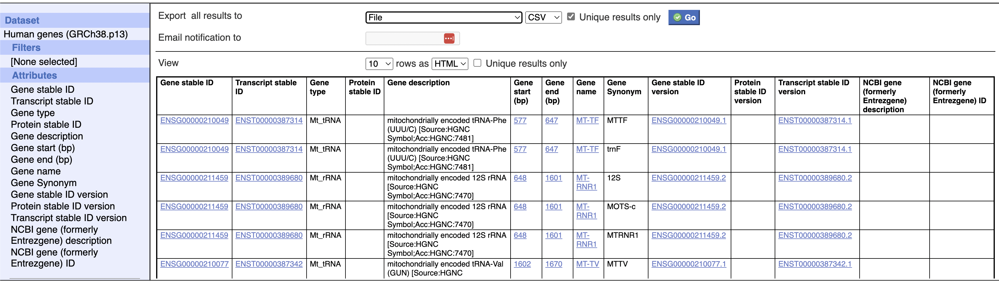

# Ensembl

Ensembl IDs were retrieved from Ensembl BioMART on June 29, 2023 for all human genes. The following attributes were used:

Later, the `Gene type` and `NCBI gene` columns were used to subset protein-coding genes that also have Entrez IDs for harmonization with the CZ CELLxGENE Census.